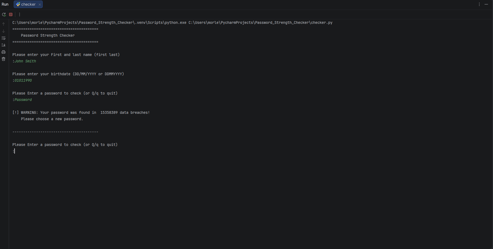
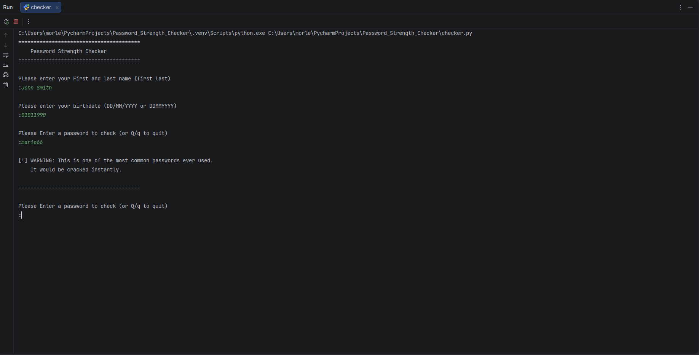
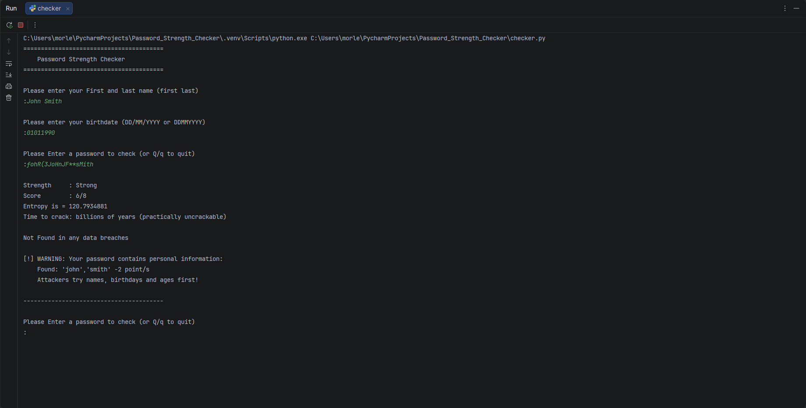
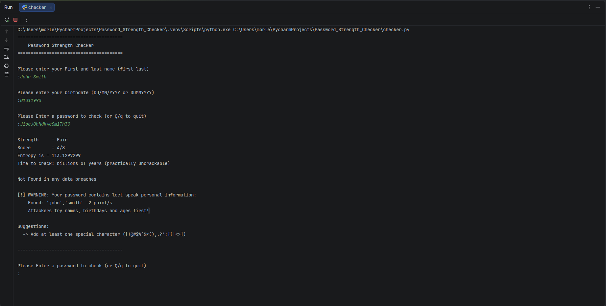
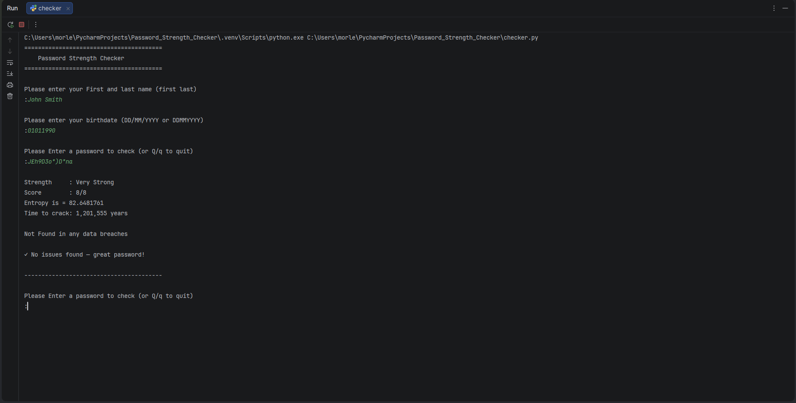

## Password_Strength_checker (Portfolio piece)

This program is a password checker designed to check a user's password using their entered name, age and date of birth against
common strength metrics such as variable character types, common passwords/sequences, and, importantly, checking against known
breached passwords via https://haveibeenpwned.com/Passwords and other strength measures, accumulating a score out of 8,
entropy value and a calculated time to crack.

## Features
* **Have I Been Pwned check**: checks against millions of real breached passwords
* **Common password detection**: checks against 10,000 most common passwords
* **Personal information detection**: checks for your name, age and birthday variations
* **Keyboard sequence detection**: detects patterns like qwerty, asdfg, 123
* **Leet speak detection**: converts substitutions (3=e, @=a) and checks if result is common
* **Password scoring**: scores out of 8 based on length, character variety and patterns
* **Entropy calculation**: calculates password strength in bits
* **Time to crack estimate**: estimates crack time based on entropy at 100 billion guesses/second

## How It Works
* **K-Anonymity (HIBP)**: your password is hashed with SHA-1, then only the first 5 characters of the hash are actually sent to
  The API. The rest is compared locally, which ensures that the full password never leaves the device.
* **Entropy**: calculated as L x log2(P) where L is the password length and P is the pool size of characters used
  (lowercase/uppercase/digits/special characters)
* **Time to crack** : derived from entropy as 2^entropy combinations divided by 200 billion (100 billion guesses x 2 for average
  case)

## Python version
* Python 3.14.0

## Installation & Usage
1. **Clone the repo:**
    ```
    git clone https://github.com/appleheart1/Password_Strength_Checker.git
    ```
2. **Navigate into the folder:**
    ```
        cd Password_Strength_Checker
    ```
3. **Install the only external dependency:**
    ```
       pip install requests
    ```
4. **Run the program:**
    ```
       python checker.py
    ```
## Example Output

**Breached Password:**


**Common Password:**


**Personal Information Warning:**


**Leet Speak Warning:**


**Strong Password:**


## Disclaimer
This tool was built for educational purposes as part of a personal portfolio. 
It is intended to demonstrate password security concepts and should not be used 
for malicious purposes.
